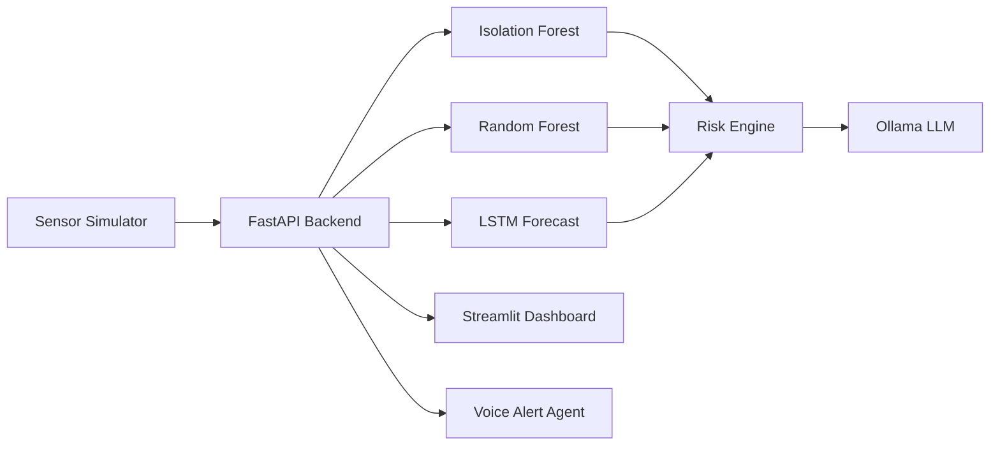

# ☢️ NuclearGuard AI

**AI-based simulated nuclear plant monitoring and predictive maintenance system**

> ⚠️ **Educational project:** NuclearGuard AI is completely simulated. The sensor data is generated locally and the project has no connection to any real nuclear reactor, plant, or industrial control system.

## What is NuclearGuard AI?

NuclearGuard AI is a project I built to explore how machine learning can be used for monitoring complex industrial systems.

The idea is fairly simple: generate simulated reactor sensor data, run it through different ML models, and use the results to identify unusual behaviour, predict possible equipment problems, and estimate the overall risk level of the plant.

The project currently uses:

* **Isolation Forest** for detecting unusual sensor readings
* **Random Forest** for estimating failure probabilities for different components
* **LSTM** for short-term temperature forecasting
* **Ollama** for generating a readable incident report from the model results

Everything runs locally. A **FastAPI** backend handles the models and API endpoints, while a **Streamlit** dashboard displays the results.

There is also an optional voice-alert script that can announce critical warnings.

---

## 🚀 What it can do

* Generate simulated reactor telemetry in real time
* Monitor temperature, pressure, neutron flux, coolant flow, vibration and radiation
* Simulate abnormal conditions for testing
* Detect anomalies using Isolation Forest
* Predict possible component failures
* Forecast the next 10 temperature readings using an LSTM
* Calculate an overall plant risk score from 0–100
* Generate AI-based incident summaries using a local LLM
* Keep a rolling alert log
* Give voice alerts when critical conditions are detected

The project is mainly meant to demonstrate how these different technologies can work together rather than to accurately model the physics of an actual nuclear reactor.

---

## 🧠 How it works



The basic flow is:

**Simulated sensors → FastAPI → ML models → Risk calculation → Dashboard / AI report / alerts**

---

## 📁 Project Structure

```text
NuclearGuard-AI/
│
├── backend/
│   └── main.py
│
├── dashboard/
│   └── streamlit_app.py
│
├── voice_alerts/
│   └── voice_assistant.py
│
├── requirements.txt
├── .gitignore
├── LICENSE
└── README.md
```

### Main files

**`backend/main.py`**

Contains the FastAPI application, sensor simulation, ML models, risk calculation and API endpoints.

**`dashboard/streamlit_app.py`**

The Streamlit interface used to display the simulated plant data and model results.

**`voice_alerts/voice_assistant.py`**

Optional script that monitors the API and speaks critical alerts.

---

## 🛠️ Tech Stack

### Backend

* Python
* FastAPI
* NumPy
* pandas
* scikit-learn
* TensorFlow / Keras
* Ollama

### Dashboard

* Streamlit
* Plotly

### Voice Alerts

* Windows PowerShell Speech API

---

## 🤖 Models

### Isolation Forest

Used for unsupervised anomaly detection.

The model looks at the current sensor values and tries to determine whether a reading looks significantly different from the normal simulated data.

### Random Forest

Used for predictive maintenance.

The system generates a failure probability for components such as:

* Coolant Pump
* Steam Generator
* Turbine
* Reactor Valve
* Heat Exchanger

These probabilities are then used as part of the overall plant risk calculation.

### LSTM

The LSTM model is used to forecast short-term temperature behaviour.

The dashboard displays the next **10 predicted temperature values** and uses the forecast to identify whether the temperature is generally moving up, down or staying relatively stable.

### Ollama

Ollama is used to run a local LLM that turns the model outputs into a more understandable incident report.

For example, instead of only showing numbers such as:

```text
Risk Score: 82
Temperature Trend: Increasing
Anomaly: Detected
```

the system can produce a short explanation of what those results mean.

---

## ⚙️ Getting Started

### Requirements

You will need:

* Python 3.10 or newer
* Ollama
* A local Ollama model

For example:

```bash
ollama pull mistral
```

### 1. Clone the repository

```bash
git clone https://github.com/<your-username>/NuclearGuard-AI.git
cd NuclearGuard-AI
```

### 2. Create a virtual environment

Windows:

```bash
python -m venv venv
venv\Scripts\activate
```

Linux / macOS:

```bash
python -m venv venv
source venv/bin/activate
```

### 3. Install the dependencies

```bash
pip install -r requirements.txt
```

### 4. Start the FastAPI backend

```bash
uvicorn backend.main:app --reload --port 8000
```

The API will be available at:

```text
http://127.0.0.1:8000
```

### 5. Start the Streamlit dashboard

Open another terminal and run:

```bash
streamlit run dashboard/streamlit_app.py
```

The dashboard should open at:

```text
http://localhost:8501
```

---

## 🔊 Voice Alerts

The voice alert system is optional.

The current implementation uses the Windows Speech API through PowerShell, so it is mainly intended for Windows.

Run:

```bash
python voice_alerts/voice_assistant.py
```

To test the anomaly simulation:

```bash
python voice_alerts/voice_assistant.py anomaly
```

If you're using Linux or macOS, the `speak()` function can be replaced with something like `pyttsx3` or the system's native text-to-speech tools.

---

## 🔌 API Endpoints

The backend currently provides these endpoints:

| Method | Endpoint                  | Purpose                          |
| ------ | ------------------------- | -------------------------------- |
| GET    | `/`                       | API health check                 |
| GET    | `/sensor-data`            | Latest simulated sensor readings |
| GET    | `/anomaly-status`         | Isolation Forest anomaly result  |
| GET    | `/risk-score`             | Overall plant risk score         |
| GET    | `/maintenance-prediction` | Component failure probabilities  |
| GET    | `/lstm-forecast`          | Next 10 temperature predictions  |
| GET    | `/incident-report`        | AI-generated incident report     |
| GET    | `/alert-log`              | Recent alerts                    |
| POST   | `/refresh`                | Generate a new sensor reading    |

Most endpoints also support:

```text
?anomaly=true
```

which forces the simulator into an abnormal condition so that the monitoring system can be tested.

Example:

```text
http://127.0.0.1:8000/sensor-data?anomaly=true
```

---

## 📊 Risk Score

The project combines the outputs from the monitoring system into a single **0–100 risk score**.

The score is intended to make the dashboard easier to understand at a glance.

A higher score means that more warning signals are being detected by the simulated system.

This is **not a real nuclear safety metric** and should not be interpreted as one.

---

## 🗺️ Things I want to improve

There are still quite a few things I'd like to add to the project:

* [ ] Store sensor history in a time-series database
* [ ] Add WebSocket-based live updates
* [ ] Docker support
* [ ] API authentication
* [ ] Automated tests
* [ ] GitHub Actions CI
* [ ] Cross-platform voice alerts
* [ ] Better model evaluation and metrics
* [ ] More realistic simulated sensor behaviour
* [ ] More detailed historical graphs

---

## ⚠️ Important Disclaimer

NuclearGuard AI is a **simulation and educational project**.

The reactor telemetry is synthetically generated and the models are being used to demonstrate machine-learning concepts such as anomaly detection, classification and time-series forecasting.

This project does **not** connect to or control a real nuclear facility, and it should not be used for real-world nuclear safety, engineering or operational decisions.

---

## 📜 License

This project is released under the MIT License. See the `LICENSE` file for details.
